# TensorFlow-Practice
### Deep Learning Framework TensorFlow 실습

* Neural Network
  * cifar10 dataset
  * fashion mnist dataset
  * mnist dataset
* Convolution Neural Network
  * cifar10 dataset
  * fashion mnist dataset
  * mnist dataset
* Transfer Learning
* DCGAN
  * mnist dataset
* TensorBoard Tutorial

## Using Cifar10 dataset
#### - cifar10 dataset
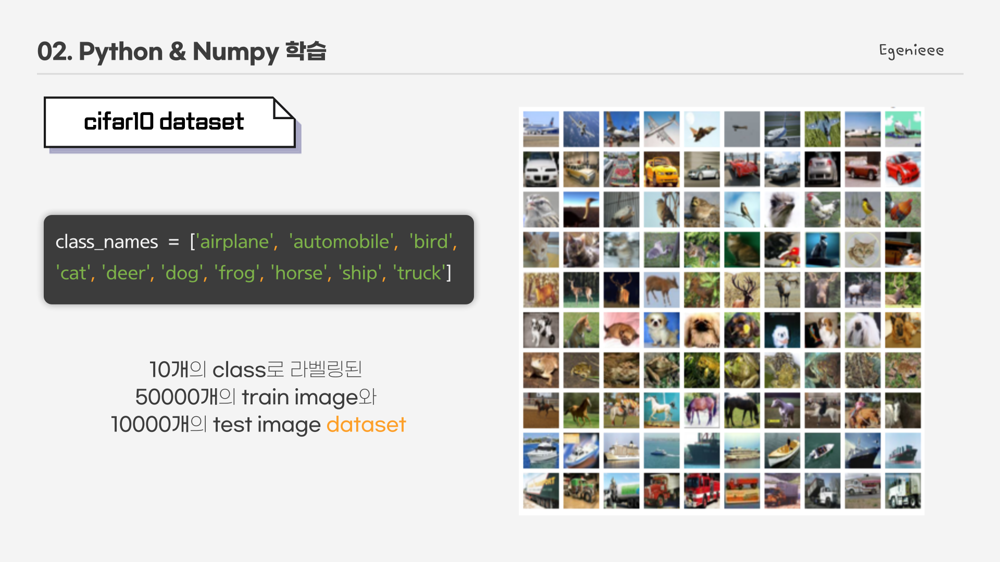

#### - model task
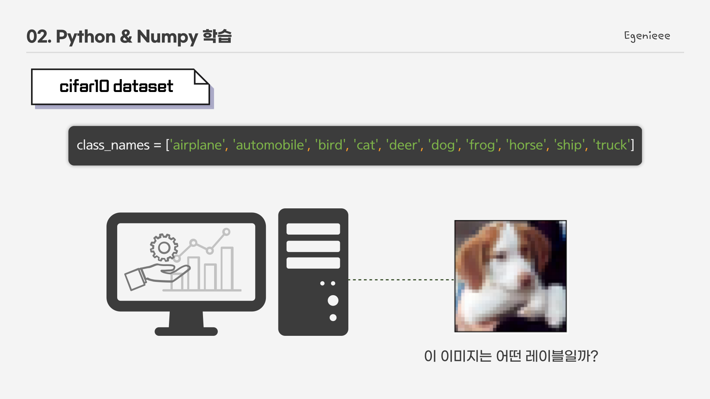

모델은 테스트 이미지가 들어왔을 때 어떤 이미지(레이블)인지 예측해야 한다.

#### - model define
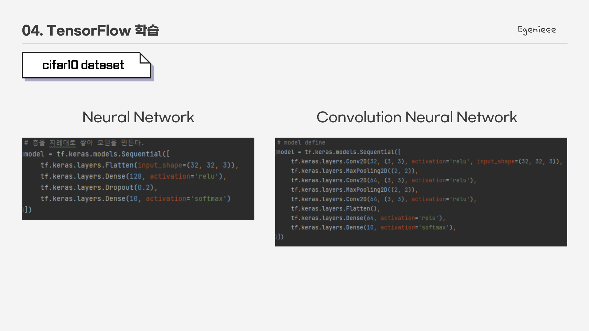

* 구현 file
> cnn_cifar10.py   
> nn_cifar10.py

## Using Fashion mnist dataset
#### - fashion mnist dataset
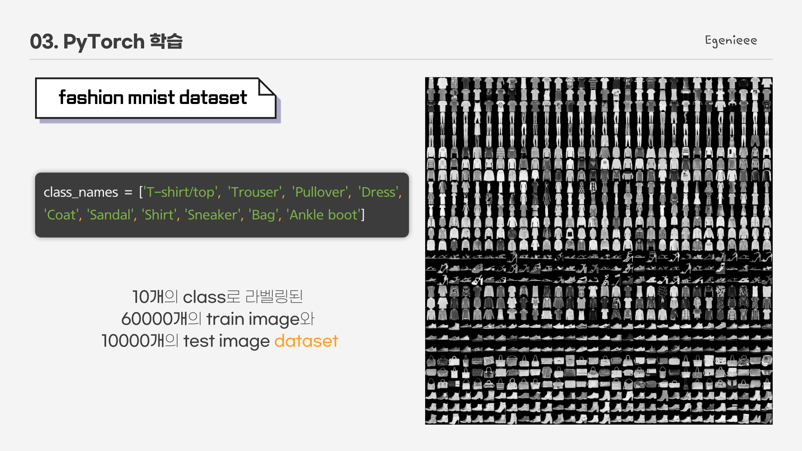

#### - model task
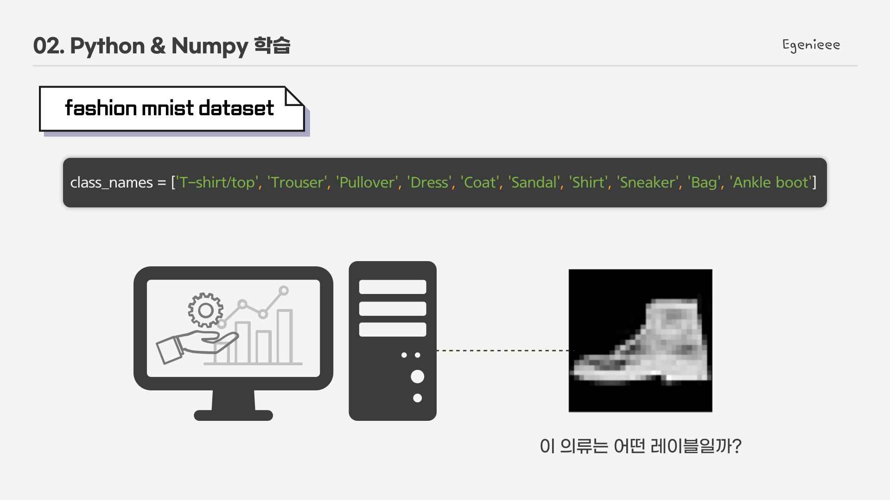

모델은 테스트 이미지가 들어왔을 때 어떤 이미지(레이블)인지 예측해야 한다.

#### - model define
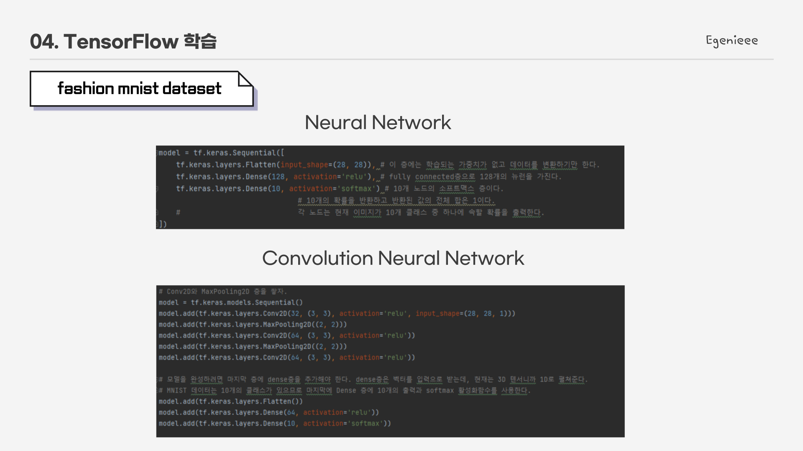

* 구현 file
> cnn_fashion_mnist.py   
> nn_fashion_mnist.py

## Using Mnist dataset
#### - mnist dataset
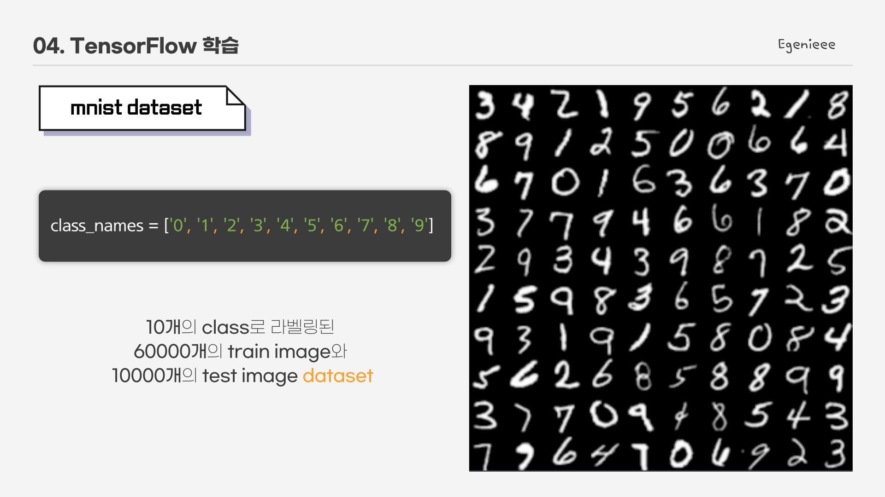

#### - model task
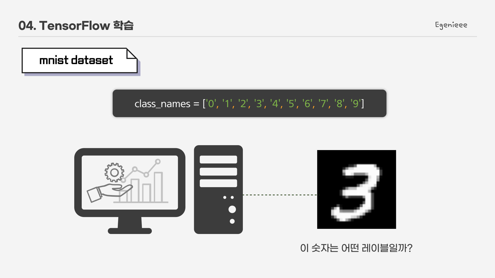

모델은 테스트 이미지가 들어왔을 때 어떤 이미지(레이블)인지 예측해야 한다.

#### - model define
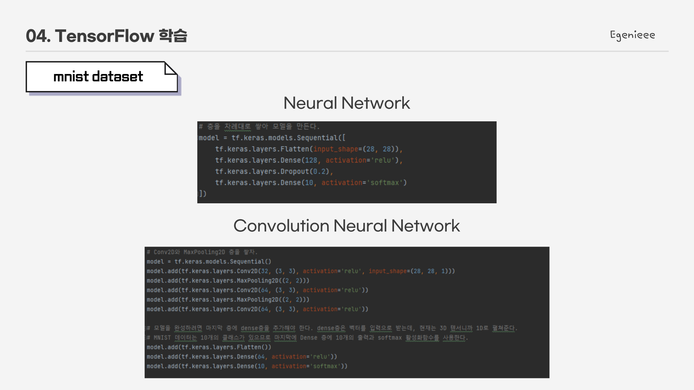

* 구현 file
> cnn_mnist.py   
> nn_mnist.py

## Transfer Learning
#### - model task
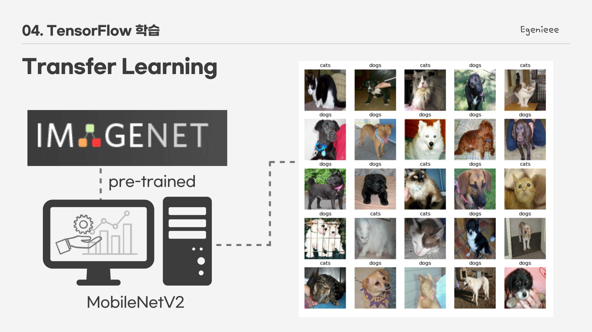

IMAGENET dataset으로 pre-trained된 MobileNetV2를 이용하여 개/고양이를 분류한다. 

#### - data augmentation
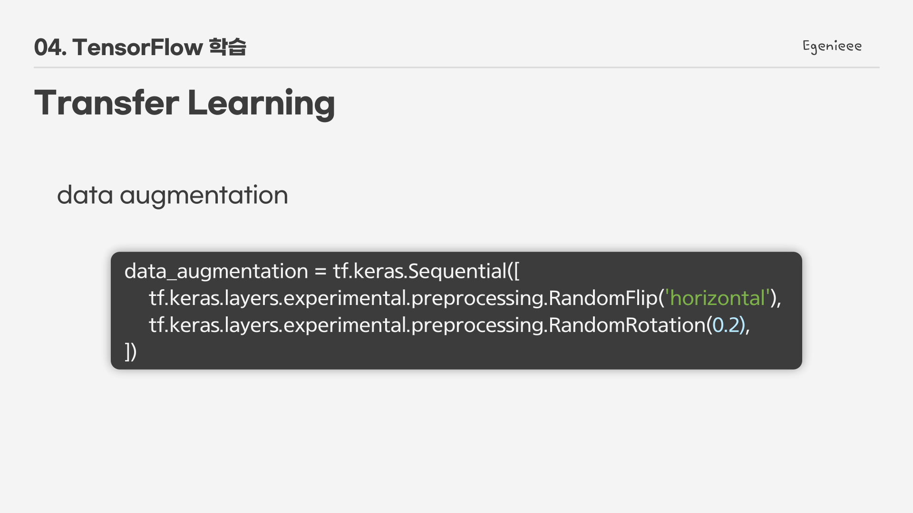

#### - base model vs fine tuned model
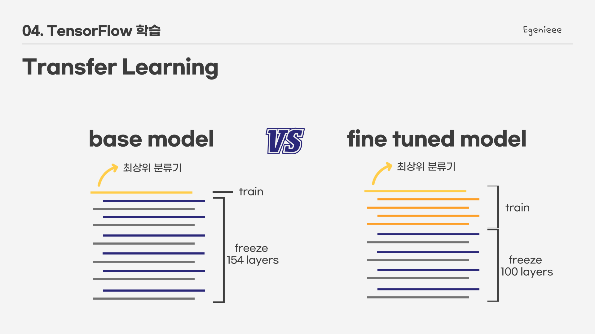

base model과 fine tuned model 두 모델의 성능 차이를 기대한다.    
fine tuned을 함으로써 내가 가지고 있는 데이터 셋에 관련되게 모델이 조정되게끔 한다.

## DCGAN
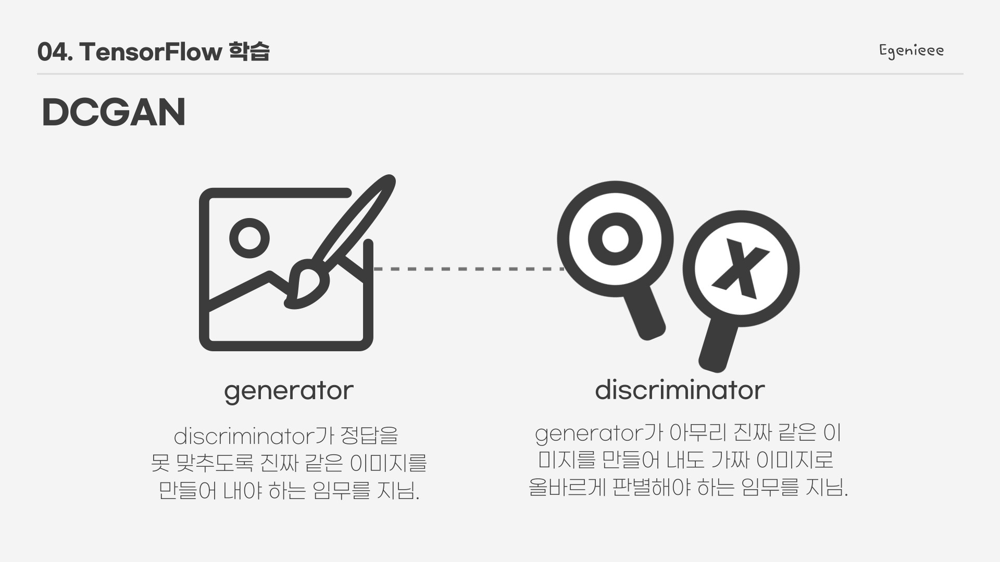

GAN은 generator model과 discriminator model을 함께 학습시킨다.

#### - generator model
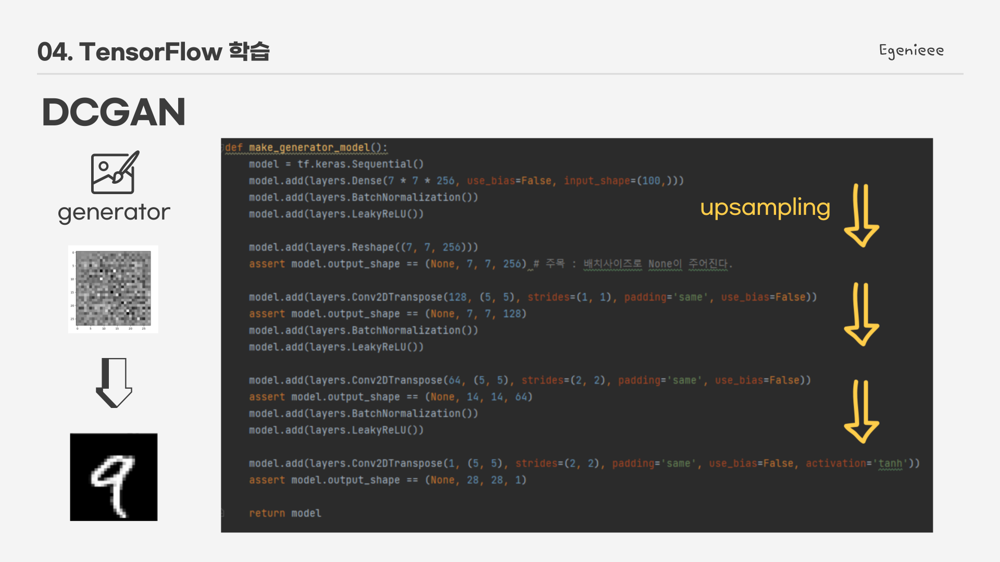

generator model은 random noise vector를 입력받아 upsampling을 통해 원하는 사이즈의 이미지를 얻는다. 

#### - discriminator model
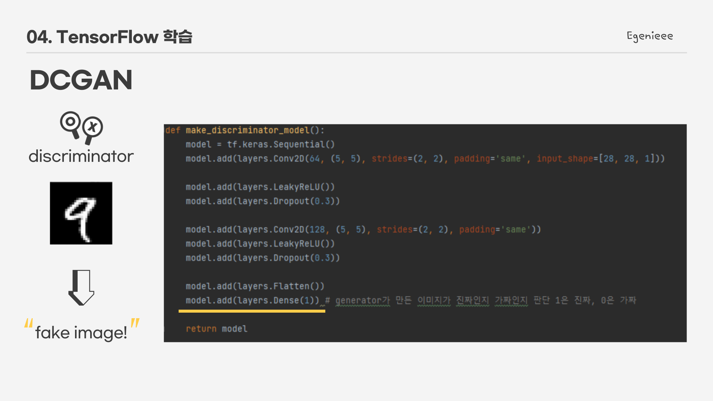

discriminator model은 CNN 기반의 모델이며, generator가 생성한 이미지가 가짜인지(0), 진짜인지(1) 예측한 값을 출력한다. 

#### - 200 epochs result
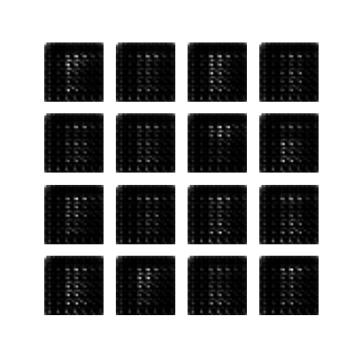

200 epoch을 돌린 결과물이다. 

***
#### 참고
* TensorFlow Tutorial : <https://www.tensorflow.org/tutorials?hl=ko>   
